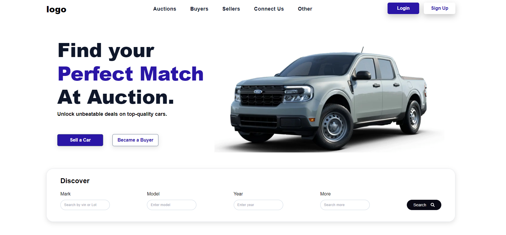

# Real-Time Car Auction 🚗

Live Link:

Welcome to the Real-Time Car Auction repository, your premier platform for buying and selling cars through dynamic, real-time auctions. Whether you're a car enthusiast looking to find your dream car or a seller wanting to reach a wide audience, our platform is designed to meet your needs.

## Overview

Real-Time Car Auction offers an interactive platform for live car auctions. Here's what you can expect from our platform:

- Participate in live car auctions from anywhere.
- Sellers can list their cars and reach a broad audience.
- Buyers can bid on a variety of cars in real time.
- Secure transactions and reliable auction processes.

## How It Works

1. **Browse Auctions:** Explore ongoing and upcoming car auctions on our platform.
2. **Register and List Cars:** Sellers can register and list their cars for auction.
3. **Place Bids:** Buyers can place bids in real time as the auction progresses.
4. **Win Auctions:** The highest bidder at the end of the auction wins the car.
5. **Secure Transactions:** Complete the transaction securely through our platform.

## Technologies Used

Real-Time Car Auction utilizes the following technologies:

- Next.js
- TypeScript
- Tailwind CSS
- WebSockets for real-time bidding
- Firebase for authentication and database

## How to Run

1. Clone or download the repository to your local machine.
2. Install dependencies by running `npm install`.
3. Start the development server with `npm run dev`.
4. Access the platform in your browser at http://localhost:3000 to start participating in auctions.

## Features

- Real-Time Bidding: Engage in live auctions with real-time updates.
- User Authentication: Secure login and registration for buyers and sellers.
- Responsive Design: Access the platform on any device.
- Auction History: View past auctions and their outcomes.
- Notifications: Receive notifications for bids, wins, and more.

## Contributing

We welcome contributions to enhance the Real-Time Car Auction platform. To contribute:
!. Fork the repository. 2. Create a new branch for your feature or bugfix. 3. Commit your changes and push the branch. 4. Submit a pull request for review.

## Contact

If you have any questions or suggestions, feel free to reach out. If you like this project, please give it a star ⭐.

Thank you for choosing Real-Time Car Auction. Happy bidding!
